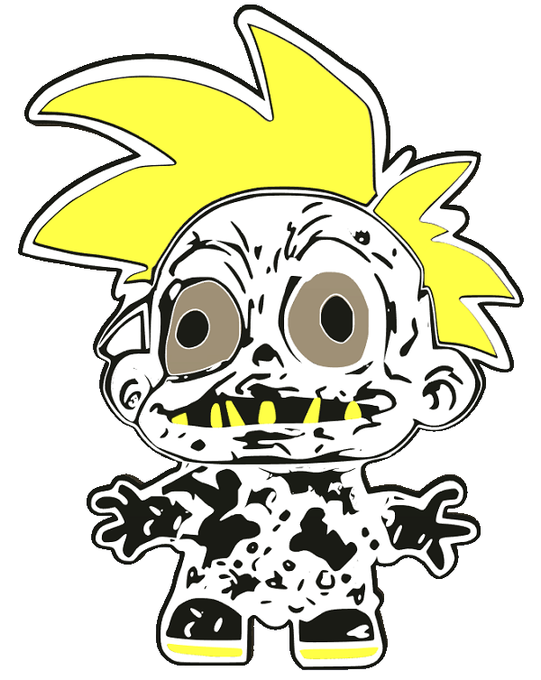

|[:skull:ISSUE](https://github.com/frankyhub/KiCad-Zombie_Garden/issues?q=is%3Aissue)|[:speech_balloon: Forum /Discussion](https://github.com/frankyhub/KiCad-Zombie_Garden/discussions)|[:grey_question:WiKi](https://github.com/frankyhub/KiCad-Zombie_Garden/wiki)||
|--|--|--|--|
| | | | |
||<a href="https://github.com/frankyhub/KiCad-Zombie_Garden/issues">|<a href="https://github.com/frankyhub/KiCad-Zombie_Garden/discussions">|<a href="https://github.com/frankyhub/KiCad-Zombie_Garden/releases">|
|| <a href="https://github.com/frankyhub/KiCad-Zombie_Garden/pulse" alt="Activity">| <a href="https://github.com/frankyhub/KiCad-Zombie_Garden/graphs/traffic">  |<a href="https://github.com/frankyhub?tab=stars"> |

# KiCad-Zombie_Garden
My ugly backlight Zombies

 

### May I introduce:

### Bruce

### Freddie

### Kylie

### Tucker

### Nicki

### Carlos

### Kathi

### Eddie

---

---

   
<ol class="breadcrumb" style="border-top: 2px solid black;border-bottom:2px solid black; height: 45px; width: 900px;"> 
<a href="#oben">nach oben</a>
</ol>

  

---

